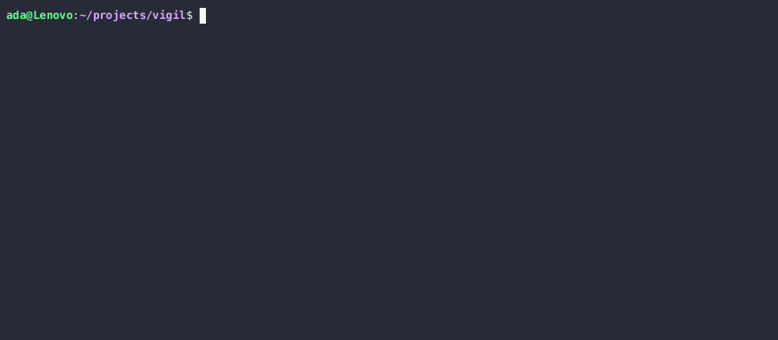

# vigil

A lightweight Linux process monitor written in C, inspired by `htop`.  
Reads directly from the `/proc` virtual filesystem to display real-time CPU and memory usage for all running processes — no external libraries, no frameworks.



## Features

- Real-time process monitoring with 1-second refresh
- CPU usage via two-sample delta method — reads `/proc/[pid]/stat` twice and computes the delta
- Memory usage from `VmRSS` in `/proc/[pid]/status`
- Sorted by CPU usage descending
- Filter processes by name: `./vigil node`
- Color-coded output: green (active), yellow (moderate), red (high CPU)
- PID-matched sampling — correctly handles processes spawning or dying between samples

## Build
```bash
git clone git@github.com:adabarbulescu/vigil.git
cd vigil
make
```

Requires `gcc` and `make`. No external dependencies.

## Usage
```bash
./vigil              # monitor all processes
./vigil <name>       # filter by process name
```

Examples:
```bash
./vigil node         # show only node processes
./vigil python3      # show only python3 processes
```

Press `Ctrl+C` to exit.

## Simulate CPU load

To observe vigil under real CPU activity, use the included stress script:
```bash
./scripts/stress.sh 8 30   # spawn 8 workers for 30 seconds
```

Then run `./vigil python3` in a second terminal to watch the workers.

## How it works

### The /proc filesystem

Linux exposes kernel data as a virtual filesystem at `/proc`. Every running process has a directory `/proc/[pid]/` containing files the kernel generates on demand. vigil walks this directory, reads each process's name, memory, and CPU ticks, and displays them in a live-updating table.

See [docs/architecture.md](docs/architecture.md) for a full data flow diagram and source reference.

### CPU percentage calculation

CPU usage cannot be read as a snapshot — the kernel only exposes cumulative ticks (total CPU time consumed since the process started). To calculate a meaningful percentage, vigil takes two samples one second apart:
```
cpu% = (ΔprocessTicks / ΔsystemTicks) × 100
```

System-wide ticks come from `/proc/stat`. Per-process ticks (`utime` + `stime`) come from fields 14–15 of `/proc/[pid]/stat`.

### PID matching between samples

Between two samples, processes can spawn or die. vigil matches processes across samples by PID — for each process in sample B, it searches sample A for a matching PID before computing the delta. Unmatched processes are assigned 0% CPU.

## Project structure
```
vigil/
  src/
    main.c        — entry point, sampling loop
    proc.c        — /proc parsing, CPU and memory reading
    proc.h        — Process and CpuSample structs, function declarations
    display.c     — sorting, color coding, terminal output
    display.h     — display function declarations
  docs/
    architecture.md   — data flow diagram and source reference
    demo.gif          — terminal recording
    demo.cast         — raw asciinema recording
  scripts/
    stress.sh     — CPU load generator for demonstration
  Makefile
```

## Technical decisions

**Why C?** Direct access to system calls and file descriptors with no abstraction layer over `/proc` parsing. The goal was to work at the same level as the kernel interface.

**Why `system("clear")` over raw ANSI escape codes?** `system("clear")` consults the terminfo database for the current `$TERM` type, making it portable across terminal emulators. Raw escape codes assume VT100 compatibility — the same assumption the color codes already make, but screen clearing felt like the wrong place to be fragile.

**Why linear search for PID matching?** With a maximum of 1024 processes, O(n²) matching costs under 1ms per refresh cycle. A hash map would be premature optimization for this use case.