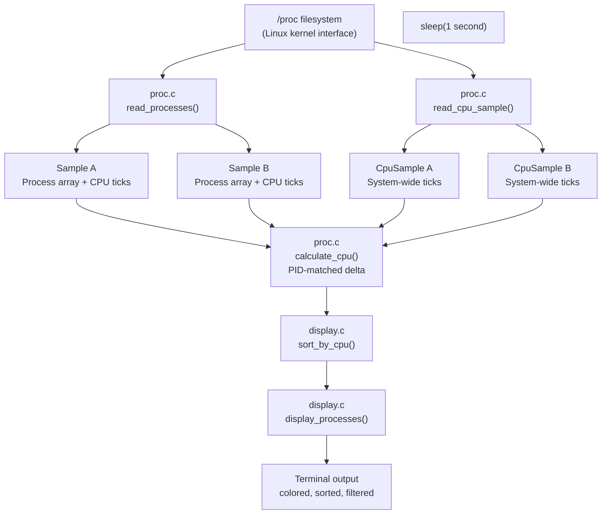

# vigil — Architecture

## Data Flow


## Per-process data sources

| Field | Source | Notes |
|-------|--------|-------|
| PID | `/proc/[pid]/` directory name | Numeric directories only |
| Name | `/proc/[pid]/comm` | Single line, stripped of newline |
| Memory | `/proc/[pid]/status` → `VmRSS` | Current resident set size in KB |
| CPU ticks | `/proc/[pid]/stat` | Fields 14 (utime) + 15 (stime) |

## System-wide CPU data

| Field | Source |
|-------|--------|
| Total ticks | `/proc/stat` first line — sum of all fields |
| Idle ticks | `/proc/stat` fields 4 + 5 (idle + iowait) |

## Two-sample CPU calculation
```
cpu% = (ΔprocessTicks / ΔsystemTicks) × 100

where:
  ΔprocessTicks = (utime_B + stime_B) - (utime_A + stime_A)
  ΔsystemTicks  = total_B - total_A
```
